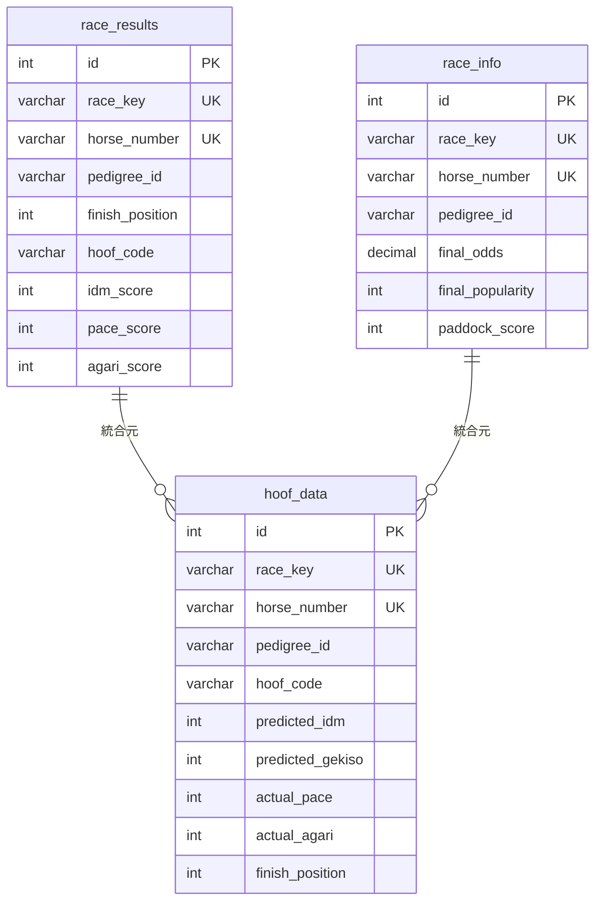

# 📊 JRDB データ仕様書

---

## 目次

1. [SED（成績データ）](#sed成績データ)
2. [TYB（直前情報データ）](#tyb直前情報データ)
3. [KYI（競走馬データ）](#kyi競走馬データ)
4. [テーブル設計](#テーブル設計)
5. [データ関連図](#データ関連図)

---

## SED（成績データ）

### ファイル形式
- **ファイル名**: `SED<YYMMDD>.txt`（例: `SED160109.txt`）
- **エンコーディング**: Shift_JIS
- **1行の長さ**: 750バイト（固定長）
- **提供時期**: 木曜午後（レース確定後）

### 主要フィールド

| バイト位置 | フィールド名 | 型 | 説明 | 例 |
|-----------|------------|---|------|-----|
| 1-8 | レースキー | VARCHAR(8) | YYPPRRNN 形式 | 16010101 |
| 9-10 | 馬番 | VARCHAR(2) | 01-18 | 01 |
| 11-18 | 血統登録番号 | VARCHAR(10) | 10桁 | 1234567890 |
| 75-76 | 着順 | INTEGER | 1-18 | 01 |
| 77-80 | レースタイム | VARCHAR(10) | 秒.コンマ | 1234 (123.4秒) |
| 81-84 | 上がり3Fタイム | VARCHAR(10) | 秒.コンマ | 0356 (35.6秒) |
| 267-270 | 蹄コード | VARCHAR(4) | 4文字 | 南田 |
| 55-59 | IDM指数 | INTEGER | 予測馬場指数 | 75 |
| 60-64 | ペース指数 | INTEGER | 実績ペース指数 | 68 |
| 65-69 | 上がり指数 | INTEGER | 実績上がり指数 | 72 |

### レースキー形式

```
YYPPRRNN
YY: 年（下2桁）例: 16 = 2016年
PP: 場コード（01-10）
  01: 札幌  02: 函館  03: 福島  04: 新潟  05: 東京
  06: 中山  07: 中京  08: 京都  09: 阪神  10: 小倉
RR: 開催回数（01-06）
NN: レース番号（01-12）

例: 16010101
  = 2016年 札幌 1回 1レース
```

### 蹄コード

蹄コードは**4文字**で構成され、装蹄師の名前が記録されます。

**主要な蹄コード例**:
- `南田` - 南田装蹄師
- `伊藤` - 伊藤装蹄師
- `小西` - 小西装蹄師
- `    `（空白4つ）- 未設定

---

## TYB（直前情報データ）

### ファイル形式
- **ファイル名**: `TYB<YYMMDD>.txt`（例: `TYB160109.txt`）
- **エンコーディング**: Shift_JIS
- **1行の長さ**: 500バイト（固定長）
- **提供時期**: レース発走直前

### 主要フィールド

| バイト位置 | フィールド名 | 型 | 説明 | 例 |
|-----------|------------|---|------|-----|
| 1-8 | レースキー | VARCHAR(8) | SED と同じ | 16010101 |
| 9-10 | 馬番 | VARCHAR(2) | 01-18 | 01 |
| 11-18 | 血統登録番号 | VARCHAR(10) | 10桁 | 1234567890 |
| 19-25 | 確定オッズ | DECIMAL(10,2) | 単勝オッズ | 0012.5 (12.5倍) |
| 26-27 | 確定人気順位 | INTEGER | 1-18 | 03 |
| 28-30 | パドック評価 | INTEGER | 0-10 | 08 |

---

## KYI（競走馬データ）

### ファイル形式
- **ファイル名**: `KYI<YYMMDD>.txt`（例: `KYI250601.txt`）
- **エンコーディング**: Shift_JIS
- **1行の長さ**: 1024バイト（固定長）
- **提供時期**: レース前日19:00

### 主要フィールド（予測指数）

| バイト位置 | フィールド名 | 型 | 説明 | 例 |
|-----------|------------|---|------|-----|
| 1-8 | レースキー | VARCHAR(8) | YYPPRRNN 形式 | 25060101 |
| 9-10 | 馬番 | VARCHAR(2) | 01-18 | 01 |
| 11-18 | 血統登録番号 | VARCHAR(10) | 10桁 | 1234567890 |
| 55-59 | 予測IDM指数 | INTEGER | 馬場指数 | 75 |
| 140-144 | 予測激走指数 | INTEGER | 激走度合い | 82 |
| 364-368 | 予測ペース指数 | INTEGER | ペース適性 | 68 |
| 369-373 | 予測上がり指数 | INTEGER | 末脚能力 | 72 |
| 359-363 | 予測テン指数 | INTEGER | 前半加速力 | 70 |
| 374-378 | 予測位置指数 | INTEGER | 位置取り能力 | 65 |
| 145-149 | 予測調教指数 | INTEGER | 調教評価 | 78 |
| 150-154 | 予測芝指数 | INTEGER | 芝適性 | 80 |
| 93-95 | レーティング | INTEGER | 総合評価 | 85 |
| 164-165 | 蹄コード | VARCHAR(4) | 装蹄師名 | 南田 |

---

## テーブル設計

### 1. race_results（SED 成績データ）

```sql
CREATE TABLE race_results (
    id SERIAL PRIMARY KEY,
    race_key VARCHAR(8) NOT NULL,
    horse_number VARCHAR(2) NOT NULL,
    pedigree_id VARCHAR(10),
    finish_position INTEGER,
    race_time VARCHAR(10),
    last_3f_time VARCHAR(10),
    hoof_code VARCHAR(4),
    idm_score INTEGER,
    pace_score INTEGER,
    agari_score INTEGER,
    position_score INTEGER,
    odds DECIMAL(10,2),
    popularity INTEGER,
    created_at TIMESTAMP DEFAULT CURRENT_TIMESTAMP,
    
    UNIQUE(race_key, horse_number)
);
```

**用途**: レース結果・蹄コード・実績指数を格納

### 2. race_info（TYB 直前情報）

```sql
CREATE TABLE race_info (
    id SERIAL PRIMARY KEY,
    race_key VARCHAR(8) NOT NULL,
    horse_number VARCHAR(2) NOT NULL,
    pedigree_id VARCHAR(10),
    final_odds DECIMAL(10,2),
    final_popularity INTEGER,
    paddock_score INTEGER,
    created_at TIMESTAMP DEFAULT CURRENT_TIMESTAMP,
    
    UNIQUE(race_key, horse_number)
);
```

**用途**: 直前オッズ・人気・パドック評価を格納

### 3. hoof_data（蹄コード・指数統合マスター）

```sql
CREATE TABLE hoof_data (
    id SERIAL PRIMARY KEY,
    race_key VARCHAR(8) NOT NULL,
    horse_number VARCHAR(2) NOT NULL,
    pedigree_id VARCHAR(10),
    race_date DATE,
    venue_code VARCHAR(2),
    race_number VARCHAR(2),
    
    -- 蹄コード
    hoof_code VARCHAR(4),
    front_left_hoof VARCHAR(1),
    front_right_hoof VARCHAR(1),
    rear_left_hoof VARCHAR(1),
    rear_right_hoof VARCHAR(1),
    
    -- 予測指数（KYI）
    predicted_idm INTEGER,
    predicted_gekiso INTEGER,
    predicted_pace INTEGER,
    predicted_agari INTEGER,
    predicted_ten INTEGER,
    predicted_position INTEGER,
    predicted_training INTEGER,
    predicted_turf INTEGER,
    predicted_rating INTEGER,
    
    -- 実績指数（SED）
    actual_pace INTEGER,
    actual_agari INTEGER,
    actual_position INTEGER,
    
    -- レース結果
    finish_position INTEGER,
    race_time VARCHAR(10),
    last_3f_time VARCHAR(10),
    
    -- オッズ・人気
    odds DECIMAL(10,2),
    popularity INTEGER,
    
    created_at TIMESTAMP DEFAULT CURRENT_TIMESTAMP,
    
    UNIQUE(race_key, horse_number)
);
```

**用途**: KYI + SED + TYB を統合したマスターテーブル

---

## データ関連図



**データフロー**:
1. **SED** → `race_results` テーブルへ投入（実績データ）
2. **TYB** → `race_info` テーブルへ投入（直前データ）
3. **KYI** → 予測指数を抽出
4. **統合** → `hoof_data` テーブルへ KYI + SED + TYB を統合

---

## 指数の意味

### 予測指数（KYI）

| 指数名 | 説明 | スケール |
|--------|------|---------|
| IDM指数 | 馬場指数。総合的な競走能力 | 0-100 |
| 激走指数 | 激走度合い。高いほど好走期待 | 0-100 |
| ペース指数 | ペース適性。前半の速さ | 0-100 |
| 上がり指数 | 末脚能力。後半の速さ | 0-100 |
| テン指数 | 前半加速力 | 0-100 |
| 位置指数 | 位置取り能力 | 0-100 |
| 調教指数 | 調教評価 | 0-100 |
| 芝指数 | 芝適性 | 0-100 |
| レーティング | 総合評価 | 0-100 |

### 実績指数（SED）

| 指数名 | 説明 | スケール |
|--------|------|---------|
| ペース指数 | 実際のペース | 0-100 |
| 上がり指数 | 実際の末脚 | 0-100 |
| 位置指数 | 実際の位置取り | 0-100 |

---

## データ統計

### データ規模

| データ種別 | ファイル数 | 総レコード数（推定） | 期間 |
|-----------|----------|-------------------|------|
| SED | 1,537 | 約30万件 | 2016-2025 |
| TYB | 513 | 約10万件 | 2016-2025 |
| KYI | 350 | 約350件 | 2025/06/01 |

### 蹄コード統計（推定）

- **設定率**: 約75%（レコードの4分の3に蹄コードあり）
- **ユニーク数**: 約50種類の装蹄師名
- **トップ10**: 全体の約60%をカバー

---

**Enable Mindset**: 仕様書完備。次は実行フェーズへ！
